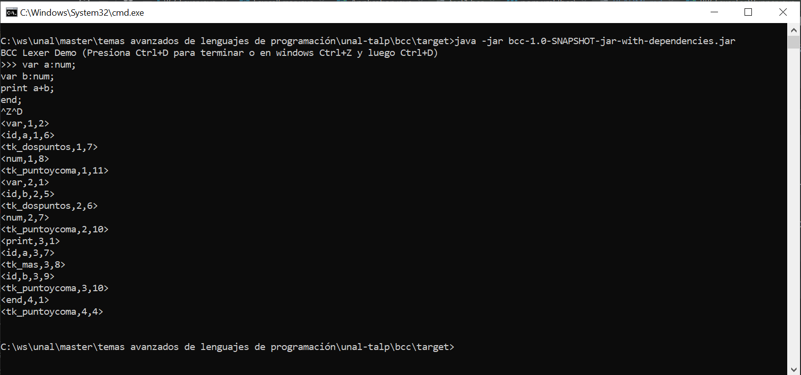

# Análizador léxico para BCC

## Introducción
bcc un lenguaje de programación diseñado principalmente para la enseñanza en los cursos de Lenguajes de Programación y Compiladores por el Profesor Juan David Velásquez de la Facultad de Minas de la Universidad Nacional de Colombia - Sede Medellín. Este semestre utilizaremos este lenguaje para desarrollar las prácticas propuestas en el curso.
La descripción del lenguaje bcc, algunos ejemplos y su gramática se pueden consultar en el siguiente artículo publicado:

J. D. Velasquez, [“bcc: A suite of Tools for Introducing Compiler Construction Techniques in the Classroom,”](https://ieeexplore.ieee.org/abstract/document/8804260?casa_token=ogUocsUg49gAAAAA:dVcAJiZKriQ_1YrB0lKp1ANuLgdHUMySUEASPMLnerQs0y00HuJnAB66vEfSDth6OT-INGGAzK8) IEEE Lat. Am. Trans., vol. 16, no. 12, pp. 2941–2946, Dec. 2018.

## Objetivo

- Desarrollar un analizador léxico para el lenguaje de programación bcc. Para realizar la implementación se podrán únicamente los siguientes lenguajes de programación: Python 3, C/C++ y Java.  

## Ejecución

Para compilar y generar un fat-jar
```
mvn clean install
```

Para ejecutar y pasar los programas por la entrada en consola
```
java -jar bcc-1.0-SNAPSHOT-jar-with-dependencies.jar
```
Se obtendrá un resultado como el de la imagen:




También puede ejecutar algunos casos de prueba ejecutando la clase BBLexerTestRunner en el IDE como 'aplicación java'.

Actualmente existen 4 casos de prueba creados para el lenguaje.

TODO:
- revisar documentación del paper para ver particularidades del lenguaje.

